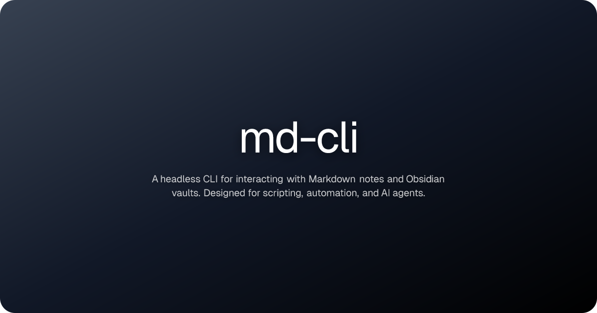

<p align="center">
  <a href="https://github.com/thejafe/md-cli">
    
  </a>
</p>

<h1 align="center">md-cli</h1>

<p align="center">
  <a href="https://opensource.org/licenses/MIT">
    
  </a>
  <a href="https://github.com/thejafe/md-cli"></a>
  
</p>


<p align="center">
 A fast, headless CLI for working with Markdown notes. Built for automation, scripting, and agentic AI workflows. Zero runtime dependencies.
Runs on <a href="bun.sh">Bun</a>.
</p>

## Why md-cli?

Markdown powers everything from personal knowledge bases to documentation, journaling, and second brains. But most tools for managing Markdown notes are GUI-first.

md-cli fills that gap by providing a composable, scriptable interface to your notes.

With md-cli you can:

- Pipe note contents into other CLI tools
- Automate note creation and editing from scripts or CI
- Search across thousands of notes in milliseconds
- Manage frontmatter and tags programmatically
- Navigate wikilink graphs from the terminal
- Give AI agents a clean interface for reading and writing Markdown notes

Works with any folder of `.md` files. First-class support for Obsidian vaults. Understands `[[wikilinks]]`, YAML frontmatter,
inline `#tags`, and daily note conventions.

## Install

```sh
bun install
```

### Compile to standalone binary

```sh
bun build --compile cli.ts --outfile md
```

## Usage

```sh
md <command> [options]
```

All commands accept `--path <path>` (`-p`) to set the notes directory. Defaults to the current working directory.

## Commands

<!-- BEGIN AUTO GENERATED REFERENCE -->

**Vault Management**

| Command | Description |
|---|---|
| `md vault init` | Register a notes directory and create its config. |
| `md vault list` | List all registered vaults. |
| `md vault status` | Show statistics: note count, total size, last modified time. |
| `md vault config` | View or update configuration. |
| `md vault unlink` | Deregister a notes directory from md-cli. |

**Note Operations**

| Command | Description |
|---|---|
| `md note list` | List all markdown notes, optionally scoped to a folder. |
| `md note read` | Print the contents of a note to stdout. |
| `md note create` | Create a new markdown note. |
| `md note edit` | Modify an existing note. |
| `md note delete` | Delete a note. |
| `md note rename` | Rename or move a note. |
| `md note search` | Full-text search across all notes. |

**Tools**

| Command | Description |
|---|---|
| `md tags` | List all tags (frontmatter `tags` field + inline `#tag` syntax). |
| `md daily` | Open or create today's daily note. |
| `md backlinks` | Find all notes that link to a given note via `[[wikilinks]]`. |
| `md links` | List all outgoing `[[wikilinks]]` in a note, with a marker for missing targets. |
| `md tree` | Print a visual directory tree, excluding hidden files and config directories. |

> Full reference: [docs/reference.md](docs/reference.md)

<!-- END AUTO GENERATED REFERENCE -->

## Development

### Generate docs

```sh
bun run gen
```

This regenerates [docs/reference.md](docs/reference.md) and updates the command table above from [lib/commands.ts](lib/commands.ts).
